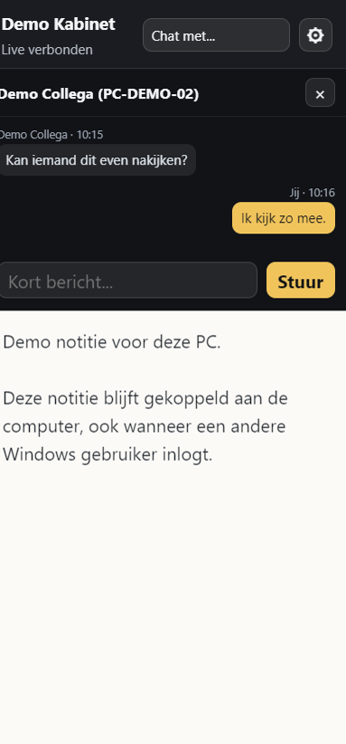
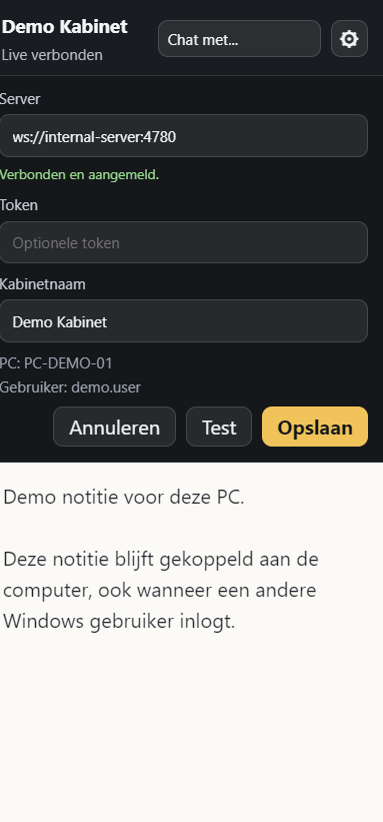
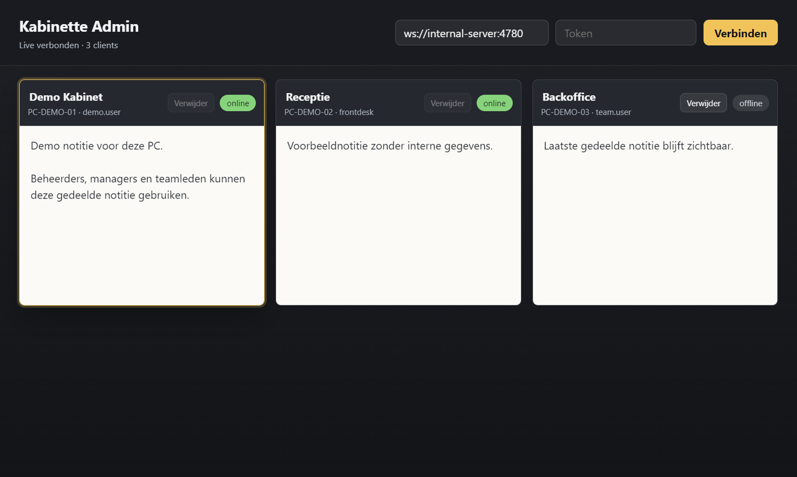
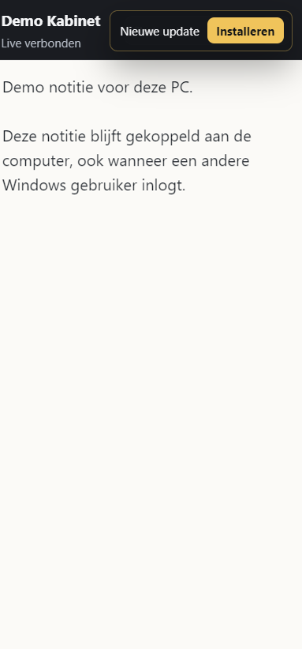

# Kabinette Notes

Kabinette Notes is a small realtime desktop notes and chat system for shared office computers.

Copyright (c) 2026 Wesley Van Hamme.
Contact: wesley.van.hamme@mondzorgzuid.be

It consists of:

- a lightweight WebSocket server
- a Windows sidebar client that stays on the screen edge
- an admin dashboard for viewing and editing connected clients
- optional machine-wide client updates through a local updater service

The project was built for internal LAN use first. It can be adapted for other office, helpdesk, reception, classroom, or shared-workstation scenarios.

## What It Is Useful For

Kabinette Notes is useful when multiple Windows users can log in on the same physical computer, but the note or message should stay linked to the computer instead of the Windows account.

Typical use cases:

- reception desks where several employees use the same workstation
- dental, medical, or office rooms where a room PC needs a persistent note
- helpdesk environments where admins or managers need to see which clients are online and what note is attached to a specific computer
- internal teams that need a small realtime side-note tool without a full ticketing system
- internal support workflows where shared computer notes help admins, managers, or team members understand what needs attention
- shared computers connected through the local network or an internal VPN

The app is designed for trusted internal networks. It also works over VPN as long as the client and admin computer can reach the server host and TCP port.

## Status

This repository is suitable for internal deployments and experimentation.

License note: this is a source-available project, not an MIT/Apache-style permissive project. You may use, modify, and share it for personal, educational, internal business, and non-commercial use. You may not sell it, package it for paid resale, or offer it as a paid hosted service without prior written notice to and written permission from Wesley Van Hamme. See `LICENSE`.

Before using it in a wider production environment, review:

- authentication and token handling
- update trust and code signing
- backup strategy for server state
- network/firewall exposure
- privacy requirements for notes and chat history

## Features

- Realtime notes per computer, shared across Windows users on the same PC.
- Admin dashboard showing connected clients.
- Admin controller for viewing and managing computer notes.
- Admin-to-client and client-to-admin live note sync.
- Internal realtime chat between clients.
- Chat history is local/client-facing and is not the main admin control surface.
- Local outbox for messages while the server is unavailable.
- Sidebar client with a tiny draggable edge tab.
- Server-first storage with local cache files.
- Optional silent client update flow for Windows deployments.

## Screenshots

These screenshots are rendered from the real app HTML/CSS with sanitized demo data. They do not contain real server addresses, real user names, patient/customer data, or internal notes.

### Client Sidebar



### Client Settings



### Admin Controller



### Client Update Prompt



## Architecture

```text
+------------------+       WebSocket        +----------------------+
| Admin dashboard  | <--------------------> | Kabinette server     |
+------------------+                        | Node.js + ws         |
                                            +----------------------+
+------------------+       WebSocket              ^  ^
| Sidebar client   | <----------------------------^  ^
| Shared PC A      |                                 ^
+------------------+                                 ^
                                                     ^
+------------------+         WebSocket               ^
| Sidebar client   |<-------------------------------+
| Shared PC B      |
+------------------+
```

## Requirements

- Windows for the Electron client/admin installers.
- Node.js 18 or newer for development.
- npm.
- Optional: .NET SDK if you want to rebuild the updater service.

## Quick Start

Install dependencies:

```powershell
npm install
```

Start the server:

```powershell
npm run server
```

Start the admin dashboard:

```powershell
npm run admin
```

Start a client:

```powershell
npm run client
```

By default the client connects to:

```text
ws://localhost:4780
```

For another computer, set the server address in the client settings or in:

```text
%ProgramData%\KabinetteNotes\config.json
```

Example:

```json
{
  "serverUrl": "ws://YOUR-SERVER-HOST:4780",
  "authToken": "optional-shared-token"
}
```

## Using The App

Run one Kabinette server on an internal server or always-on workstation. Clients and admins connect to that server through WebSocket.

Client workflow:

- install the client on each shared Windows computer
- open the small side tab on the screen edge
- write a note for that computer
- the note is stored server-first and cached locally in `%ProgramData%\KabinetteNotes\`
- when another Windows user logs in on the same PC, the same computer note stays available
- use the chat panel for quick internal messages between connected clients

Admin controller workflow:

- open the admin dashboard
- connect to the same server URL and token as the clients
- view connected computers
- search clients
- read or edit notes for a selected computer
- use the shared note to understand what needs attention on computer X
- manage notes that are useful for admins, managers, and team members

The admin app is therefore not only a settings panel. It is the beheer/admin controller for the shared notes: the place where a responsible user can see all connected clients, inspect notes, and keep computer-specific information visible for admins, managers, and team members.

Update workflow:

- build a new client package
- place the generated update files next to the server executable or in the server `dist/` folder
- clients compare their installed `app:x.y.z` version with the server update version
- if a newer update is available, the client shows an update prompt
- the updater downloads the new installer before closing the old client and installing the new version

For VPN use, the setup is the same as LAN use. Use the VPN-reachable hostname or IP in the client/admin server URL, for example:

```text
ws://internal-notes-server:4780
```

or, when using TLS through a reverse proxy:

```text
wss://notes.example.internal
```

## Configuration

### Server Environment Variables

| Variable | Default | Purpose |
| --- | --- | --- |
| `PORT` | `4780` | HTTP/WebSocket port. |
| `KABINETTE_TOKEN` | empty | Optional shared token required by admin and clients. |
| `KABINETTE_PUBLIC_HOST` | auto-detected request host | Public host used in generated update URLs. |
| `KABINETTE_PUBLIC_UPDATE_URL` | empty | Full override for the client update URL. |
| `KABINETTE_STATE_PATH` | `kabinette-server-state.json` | Server state file path. |

Example:

```powershell
$env:PORT="4780"
$env:KABINETTE_TOKEN="change-this-token"
$env:KABINETTE_PUBLIC_HOST="notes-server.local"
npm run server
```

### Client Environment Variables

| Variable | Default | Purpose |
| --- | --- | --- |
| `APP_MODE` | inferred | Use `client` or `admin` during development. |
| `KABINETTE_DEFAULT_SERVER_URL` | `ws://localhost:4780` | Default URL for new client configs. |

Example:

```powershell
$env:KABINETTE_DEFAULT_SERVER_URL="ws://notes-server.local:4780"
npm run client
```

### Updater Service Environment Variables

| Variable | Default | Purpose |
| --- | --- | --- |
| `KABINETTE_UPDATE_HOST` | empty | Optional host allowlist for update downloads. |

If `KABINETTE_UPDATE_HOST` is empty, the local updater service accepts the update host supplied by the client/server. For stricter internal deployments, set it to your update server hostname.

## Data Locations

On Windows, client data is shared per computer:

```text
%ProgramData%\KabinetteNotes\
```

Important files:

- `config.json`
- `note.txt`
- `chat-outbox.json`
- `chat-history.json`
- `update.log`
- `updater-service.log`

The server state defaults to:

```text
kabinette-server-state.json
```

Keep this file backed up if the notes/chat history matter.

## Building

The recommended build path on Windows is:

```powershell
.\scripts\build-packages.ps1
```

The script installs npm dependencies, checks JavaScript syntax, builds the updater service, builds the server executable, builds the machine-wide client installer, prepares the server-hosted update files, and builds the admin installer.

Required build tools:

- Node.js 18 or newer
- npm
- .NET SDK for the client updater service
- Windows, because the packaged client/admin installers target Windows

Generated packages:

- `dist\KabinetteServer.exe`
- `dist\client\Kabinette Notes Client Setup x.y.z.exe`
- `dist\admin\Kabinette Notes Admin Setup x.y.z.exe`
- `dist\client-installer.exe`
- `dist\client-setup.exe`
- matching `.blockmap` and `.version` files for client updates

Useful variants:

```powershell
.\scripts\build-packages.ps1 -Clean
.\scripts\build-packages.ps1 -CheckOnly
.\scripts\build-packages.ps1 -NoClient
.\scripts\build-packages.ps1 -NoAdmin
.\scripts\build-packages.ps1 -NoServer
```

Manual build commands are also available:

```powershell
npm run build:server
npm run build:client
npm run build:admin
```

Outputs are written to `dist/`.

## Deploying Client Updates

The server can expose client installers through:

```text
/updates/client.exe
/updates/client-setup.exe
```

The recommended `.\scripts\build-packages.ps1` script prepares these files automatically in `dist/`:

- `client-installer.exe`
- `client-installer.exe.blockmap`
- `client-installer.version`
- `client-installer.exe.version`
- `client-setup.exe`
- `client-setup.exe.blockmap`
- `client-setup.version`
- `client-setup.exe.version`

Each `.version` file must contain the app update version:

```text
app:x.y.z
```

If you build the client manually, prepare the update files like this:

```powershell
$version = "app:x.y.z"
$setup = "dist\client\Kabinette Notes Client Setup x.y.z.exe"
$blockmap = "$setup.blockmap"

Copy-Item $setup "dist\client-installer.exe" -Force
Copy-Item $setup "dist\client-setup.exe" -Force
Copy-Item $blockmap "dist\client-installer.exe.blockmap" -Force
Copy-Item $blockmap "dist\client-setup.exe.blockmap" -Force

Set-Content "dist\client-installer.version" $version -NoNewline
Set-Content "dist\client-installer.exe.version" $version -NoNewline
Set-Content "dist\client-setup.version" $version -NoNewline
Set-Content "dist\client-setup.exe.version" $version -NoNewline
```

Check the active update version:

```powershell
Invoke-RestMethod "http://YOUR-SERVER-HOST:4780/health?updateProtocol=2&installedUpdateVersion=app:x.y.z"
```

Expected when the installed version equals the server version:

```json
{
  "updateAvailable": false,
  "updateVersion": "app:x.y.z",
  "updateUrl": ""
}
```

## Windows Firewall

Open inbound TCP port `4780` on the server for trusted/private networks.

PowerShell example:

```powershell
New-NetFirewallRule `
  -DisplayName "Kabinette Notes Server 4780" `
  -Direction Inbound `
  -Protocol TCP `
  -LocalPort 4780 `
  -Action Allow `
  -Profile Private
```

## Security Notes

- Use `KABINETTE_TOKEN` for any networked deployment.
- Do not expose the server directly to the public internet without a reverse proxy, TLS, and additional authentication.
- Consider signing Windows installers before deploying at scale.
- Treat notes and chat messages as sensitive internal data.

## Repository Hygiene

Do not commit generated output:

- `node_modules/`
- `dist/`
- `build/updater-service-publish/`
- `build/KabinetteUpdaterService.exe`
- `src/updater-service/bin/`
- `src/updater-service/obj/`
- `kabinette-server-state.json`
- local logs and `.env` files

## License

Source-available with commercial resale restrictions. See `LICENSE`.
